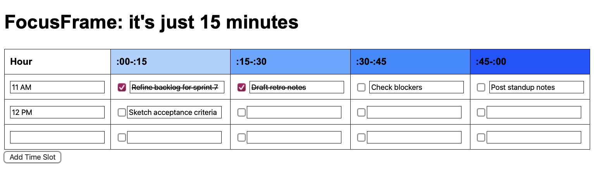

# FocusFrame

**FocusFrame** is a lightweight 15-minute task tracker built using pure HTML, CSS, and vanilla JavaScript — no libraries, no frameworks, no distractions.

Originally created to help an overwhelmed team member break down an insurmountable to-do list, FocusFrame uses timeboxing principles to turn big tasks into approachable wins.

## Demo

## Features

- Hourly task layout broken into four 15-minute sprints
- Simple to use workflow
- Color-coded time segments for easy scanning
- Check boxes cross off completed time blocks
- Lightweight, mobile-friendly structure

## Inspiration

Built with Agile principles like timeboxing, iterative focus, and manageable sprints in mind — but designed for real humans, not just project plans.

## Live Demo

[Try FocusFrame here!](https://hellomynameisariel.github.io/focusframe/focusframe.html)

## License

MIT License — free to use, modify, or improve.
